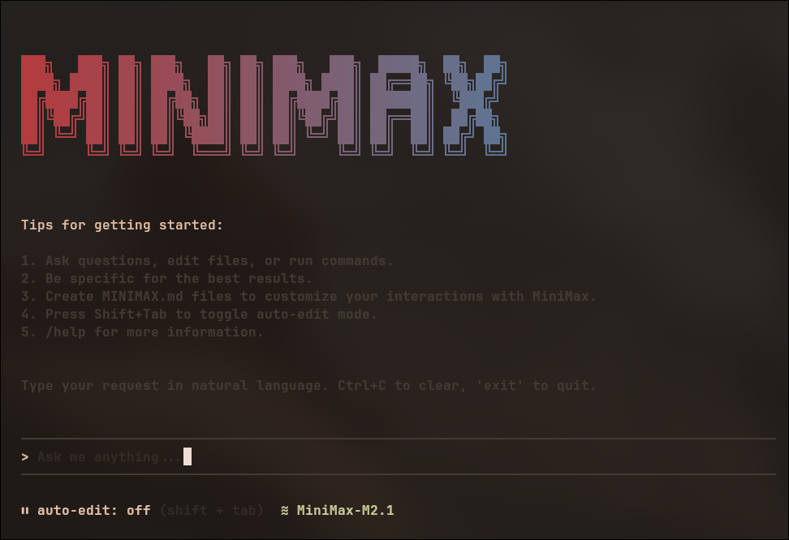

# MiniMax CLI

A conversational AI CLI tool powered by MiniMax with intelligent text editor capabilities and tool usage.



## Features

- **🤖 Conversational AI**: Natural language interface powered by MiniMax
- **📝 Smart File Operations**: AI automatically uses tools to view, create, and edit files
- **🔍 File References with Autocomplete**: Reference files using @ syntax with intelligent tab completion
- **⚡ Bash Integration**: Execute shell commands through natural conversation
- **🔧 Automatic Tool Selection**: AI intelligently chooses the right tools for your requests
- **🚀 Morph Fast Apply**: Optional high-speed code editing at 4,500+ tokens/sec with 98% accuracy
- **🔌 MCP Tools**: Extend capabilities with Model Context Protocol servers (Linear, GitHub, etc.)
- **💬 Interactive UI**: Beautiful terminal interface built with Ink
- **🌍 Global Installation**: Install and use anywhere with `bun add -g minimax-cli`

## Licensing

This software uses a dual licensing model:

- **Open Source Use**: Licensed under AGPL-3.0 for individual developers, researchers, and non-commercial projects
- **Commercial Use**: Requires a commercial license for business use, redistribution, or deployment in commercial products

See [LICENSE.md](LICENSE.md) for detailed licensing information.

## Installation

### Prerequisites
- Bun 1.0+ (or Node.js 18+ as fallback)
- MiniMax API key
- (Optional, Recommended) Morph API key for Fast Apply editing

### Global Installation (Recommended)
```bash
bun add -g minimax-cli
```

Or with npm (fallback):
```bash
npm install -g minimax-cli
```

### Local Development
```bash
git clone <repository>
cd minimax-cli
bun install
bun run build
bun link
```

## Setup

1. Get your MiniMax API key

2. Set up your API key (choose one method):

**Method 1: Environment Variable**
```bash
export MINIMAX_API_KEY=your_api_key_here
```

**Method 2: .env File**
```bash
cp .env.example .env
# Edit .env and add your API key
```

**Method 3: Command Line Flag**
```bash
minimax --api-key your_api_key_here
```

**Method 4: User Settings File**
Create `~/.minimax/user-settings.json`:
```json
{
  "apiKey": "your_api_key_here"
}
```

3. (Optional, Recommended) Get your Morph API key from [Morph Dashboard](https://morphllm.com/dashboard/api-keys)

4. Set up your Morph API key for Fast Apply editing (choose one method):

**Method 1: Environment Variable**
```bash
export MORPH_API_KEY=your_morph_api_key_here
```

**Method 2: .env File**
```bash
# Add to your .env file
MORPH_API_KEY=your_morph_api_key_here
```

### Custom Base URL (Optional)

By default, the CLI uses MiniMax API endpoints. You can configure a custom endpoint if needed (choose one method):

**Method 1: Environment Variable**
```bash
export MINIMAX_BASE_URL=https://your-custom-endpoint.com/v1
```

**Method 2: Command Line Flag**
```bash
minimax --api-key your_api_key_here --base-url https://your-custom-endpoint.com/v1
```

**Method 3: User Settings File**
Add to `~/.minimax/user-settings.json`:
```json
{
  "apiKey": "your_api_key_here",
  "baseURL": "https://your-custom-endpoint.com/v1"
}
```

## Configuration Files

MiniMax CLI uses two types of configuration files to manage settings:

### User-Level Settings (`~/.minimax/user-settings.json`)

This file stores **global settings** that apply across all projects. These settings rarely change and include:

- **API Key**: Your MiniMax API key
- **Base URL**: Custom API endpoint (if needed)
- **Default Model**: Your preferred model (e.g., `minimax-01`)
- **Available Models**: List of models you can use

**Example:**
```json
{
  "apiKey": "your_api_key_here",
  "baseURL": "https://api.minimax.com/v1",
  "defaultModel": "minimax-fast-1",
  "models": [
    "minimax-fast-1",
    "minimax-pro",
    "minimax-ultra"
  ]
}
```

### Project-Level Settings (`.minimax/settings.json`)

This file stores **project-specific settings** in your current working directory. It includes:

- **Current Model**: The model currently in use for this project
- **MCP Servers**: Model Context Protocol server configurations

**Example:**
```json
{
  "model": "minimax-pro",
  "mcpServers": {
    "linear": {
      "name": "linear",
      "transport": "stdio",
      "command": "npx",
      "args": ["@linear/mcp-server"]
    }
  }
}
```

### How It Works

1. **Global Defaults**: User-level settings provide your default preferences
2. **Project Override**: Project-level settings override defaults for specific projects
3. **Directory-Specific**: When you change directories, project settings are loaded automatically
4. **Fallback Logic**: Project model → User default model → System default (`minimax-fast-1`)

This means you can have different models for different projects while maintaining consistent global settings like your API key.

### Using Other API Providers

**Important**: MiniMax CLI uses **OpenAI-compatible APIs**. You can use any provider that implements the OpenAI chat completions standard.

**Popular Providers**:
- **MiniMax**: `https://api.minimax.com/v1` (default)
- **OpenAI**: `https://api.openai.com/v1`
- **OpenRouter**: `https://openrouter.ai/api/v1`
- **Groq**: `https://api.groq.com/openai/v1`

**Example with OpenRouter**:
```json
{
  "apiKey": "your_openrouter_key",
  "baseURL": "https://openrouter.ai/api/v1",
  "defaultModel": "minimax/abab6.5s",
  "models": [
    "minimax/abab6.5s",
    "anthropic/claude-3.5-sonnet",
    "openai/gpt-4o"
  ]
}
```

## Usage

### Interactive Mode

Start the conversational AI assistant:
```bash
minimax
```

Or specify a working directory:
```bash
minimax -d /path/to/project
```

### Headless Mode

Process a single prompt and exit (useful for scripting and automation):
```bash
minimax --prompt "show me the package.json file"
minimax -p "create a new file called example.js with a hello world function"
minimax --prompt "run bun test and show me the results" --directory /path/to/project
minimax --prompt "complex task" --max-tool-rounds 50  # Limit tool usage for faster execution
```

This mode is particularly useful for:
- **CI/CD pipelines**: Automate code analysis and file operations
- **Scripting**: Integrate AI assistance into shell scripts
- **Terminal benchmarks**: Perfect for tools like Terminal Bench that need non-interactive execution
- **Batch processing**: Process multiple prompts programmatically

### Tool Execution Control

By default, MiniMax CLI allows up to 400 tool execution rounds to handle complex multi-step tasks. You can control this behavior:

```bash
# Limit tool rounds for faster execution on simple tasks
minimax --max-tool-rounds 10 --prompt "show me the current directory"

# Increase limit for very complex tasks (use with caution)
minimax --max-tool-rounds 1000 --prompt "comprehensive code refactoring"

# Works with all modes
minimax --max-tool-rounds 20  # Interactive mode
minimax git commit-and-push --max-tool-rounds 30  # Git commands
```

**Use Cases**:
- **Fast responses**: Lower limits (10-50) for simple queries
- **Complex automation**: Higher limits (500+) for comprehensive tasks
- **Resource control**: Prevent runaway executions in automated environments

### Model Selection

You can specify which AI model to use with the `--model` parameter or `MINIMAX_MODEL` environment variable:

**Method 1: Command Line Flag**
```bash
# Use MiniMax models
minimax --model minimax-fast-1
minimax --model minimax-pro
minimax --model minimax-ultra

# Use other models (with appropriate API endpoint)
minimax --model gemini-2.5-pro --base-url https://api-endpoint.com/v1
minimax --model claude-sonnet-4-20250514 --base-url https://api-endpoint.com/v1
```

**Method 2: Environment Variable**
```bash
export MINIMAX_MODEL=minimax-fast-1
minimax
```

**Method 3: User Settings File**
Add to `~/.minimax/user-settings.json`:
```json
{
  "apiKey": "your_api_key_here",
  "defaultModel": "minimax-fast-1"
}
```

**Model Priority**: `--model` flag > `MINIMAX_MODEL` environment variable > user default model > system default (minimax-fast-1)

### Command Line Options

```bash
minimax [options]

Options:
  -V, --version          output the version number
  -d, --directory <dir>  set working directory
  -k, --api-key <key>    MiniMax API key (or set MINIMAX_API_KEY env var)
  -u, --base-url <url>   MiniMax API base URL (or set MINIMAX_BASE_URL env var)
  -m, --model <model>    AI model to use (e.g., minimax-fast-1, minimax-pro) (or set MINIMAX_MODEL env var)
  -p, --prompt <prompt>  process a single prompt and exit (headless mode)
  --max-tool-rounds <rounds>  maximum number of tool execution rounds (default: 400)
  -h, --help             display help for command
```

### Custom Instructions

You can provide custom instructions to tailor MiniMax's behavior to your project or globally. MiniMax CLI supports both project-level and global custom instructions.

#### Project-Level Instructions

Create a `.minimax/MINIMAX.md` file in your project directory to provide instructions specific to that project:

```bash
mkdir .minimax
```

Create `.minimax/MINIMAX.md` with your project-specific instructions:
```markdown
# Custom Instructions for This Project

Always use TypeScript for any new code files.
When creating React components, use functional components with hooks.
Prefer const assertions and explicit typing over inference where it improves clarity.
Always add JSDoc comments for public functions and interfaces.
Follow the existing code style and patterns in this project.
```

#### Global Instructions

For instructions that apply across all projects, create `~/.minimax/MINIMAX.md` in your home directory:

```bash
mkdir -p ~/.minimax
```

Create `~/.minimax/MINIMAX.md` with your global instructions:
```markdown
# Global Custom Instructions for MiniMax CLI

Always prioritize code readability and maintainability.
Use descriptive variable names and add comments for complex logic.
Follow best practices for the programming language being used.
When suggesting code changes, consider performance implications.
```

#### Priority Order

MiniMax will load custom instructions in the following priority order:
1. **Project-level** (`.minimax/MINIMAX.md` in current directory) - takes highest priority
2. **Global** (`~/.minimax/MINIMAX.md` in home directory) - fallback if no project instructions exist

If both files exist, project instructions will be used. If neither exists, MiniMax operates with its default behavior.

The custom instructions are added to MiniMax's system prompt and influence its responses across all interactions in the respective context.

## Morph Fast Apply (Optional)

MiniMax CLI supports Morph's Fast Apply model for high-speed code editing at **4,500+ tokens/sec with 98% accuracy**. This is an optional feature that provides lightning-fast file editing capabilities.

**Setup**: Configure your Morph API key following the [setup instructions](#setup) above.

### How It Works

When `MORPH_API_KEY` is configured:
- **`edit_file` tool becomes available** alongside the standard `str_replace_editor`
- **Optimized for complex edits**: Use for multi-line changes, refactoring, and large modifications
- **Intelligent editing**: Uses abbreviated edit format with `// ... existing code ...` comments
- **Fallback support**: Standard tools remain available if Morph is unavailable

**When to use each tool:**
- **`edit_file`** (Morph): Complex edits, refactoring, multi-line changes
- **`str_replace_editor`**: Simple text replacements, single-line edits

### Example Usage

With Morph Fast Apply configured, you can request complex code changes:

```bash
minimax --prompt "refactor this function to use async/await and add error handling"
minimax -p "convert this class to TypeScript and add proper type annotations"
```

The AI will automatically choose between `edit_file` (Morph) for complex changes or `str_replace_editor` for simple replacements.

## File References with Autocomplete

You can reference files directly in your messages using the `@` syntax with intelligent autocomplete. As you type `@`, the CLI shows available files that you can navigate with arrow keys and select with Tab/Enter. This automatically includes the file contents in your conversation context, allowing the AI to analyze and work with specific files.

### Usage Examples

```bash
# Reference a single file
minimax --prompt "@package.json what dependencies are outdated?"

# Reference multiple files
minimax -p "@src/index.ts @src/utils.ts explain how these files work together"

# Include files in complex requests
minimax --prompt "@README.md @package.json help me improve the documentation"

# Reference directories (shows directory listing)
minimax -p "@src what files are in the source directory?"
```

### Features

- **Automatic file reading**: Files are read and included in context when you send your message
- **Visual feedback**: The CLI shows which files were successfully referenced
- **Error handling**: Files that can't be read show error messages
- **Directory support**: `@directory` shows directory contents
- **Large file handling**: Very large files are automatically truncated
- **Path resolution**: Relative and absolute paths are supported

### Syntax

- `@filename.ext` - Reference a specific file
- `@path/to/file.ext` - Reference a file in a subdirectory
- `@directory/` - List contents of a directory
- `@./filename.ext` - Explicit relative path

## MCP Tools

MiniMax CLI supports MCP (Model Context Protocol) servers, allowing you to extend the AI assistant with additional tools and capabilities.

### Adding MCP Tools

#### Add a custom MCP server:
```bash
# Add an stdio-based MCP server
minimax mcp add my-server --transport stdio --command "bun" --args server.js

# Add an HTTP-based MCP server
minimax mcp add my-server --transport http --url "http://localhost:3000"

# Add with environment variables
minimax mcp add my-server --transport stdio --command "python" --args "-m" "my_mcp_server" --env "API_KEY=your_key"
```

#### Add from JSON configuration:
```bash
minimax mcp add-json my-server '{"command": "bun", "args": ["server.js"], "env": {"API_KEY": "your_key"}}'
```

### Linear Integration Example

To add Linear MCP tools for project management:

```bash
# Add Linear MCP server
minimax mcp add linear --transport sse --url "https://mcp.linear.app/sse"
```

This enables Linear tools like:
- Create and manage Linear issues
- Search and filter issues
- Update issue status and assignees
- Access team and project information

### Managing MCP Servers

```bash
# List all configured servers
minimax mcp list

# Test server connection
minimax mcp test server-name

# Remove a server
minimax mcp remove server-name
```

### Available Transport Types

- **stdio**: Run MCP server as a subprocess (most common)
- **http**: Connect to HTTP-based MCP server
- **sse**: Connect via Server-Sent Events

